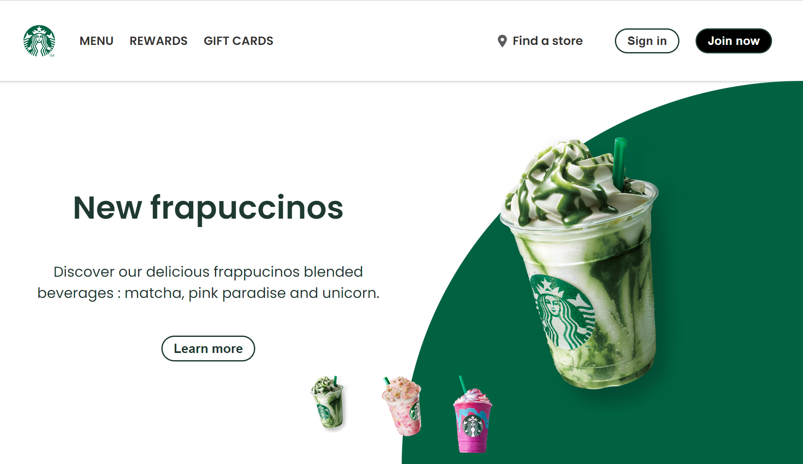

# landing-page-starbucks

This project is a redesign of Starbucks landing page, an American coffee chain, aiming to create a more engaging and intuitive experience for the user ([check original website : starbucks.com](https://www.starbucks.com/)). 

## Table of Contents

- [Demo](#demo)
- [Stack](#stack)
- [Screenshot](#screenshot)
- [Main features](#main-features)
- [Run the project locally](#run-the-project-locally)
- [Contact](#contact)

## Demo

You can view the project live demo [here](https://jesselessa.github.io/landing-page-starbucks/).

## Stack

This project has been created with HTML, CSS and JavaScript.

## Screenshot

## Main features

- **Responsive design :** the landing page is designed to work seamlessly on various screen sizes.
- **Animated elements and engaging content :** you can enjoy the visually appealing animations, including the burger menu and selection between different beverages on homepage.

## Run the project locally

1. Clone the repository : `git clone https://github.com/jesselessa/landing-page-starbucks.git`
2. Navigate to the project directory : `cd landing-page-starbucks`
3. Open the `index.html` file in your preferred browser.

## Contact

For inquiries, contact me via [LinkedIn](https://www.linkedin.com/in/jesselessa/).

---

&copy; 2023, Jessica ELESSA - Tous droits réservés
