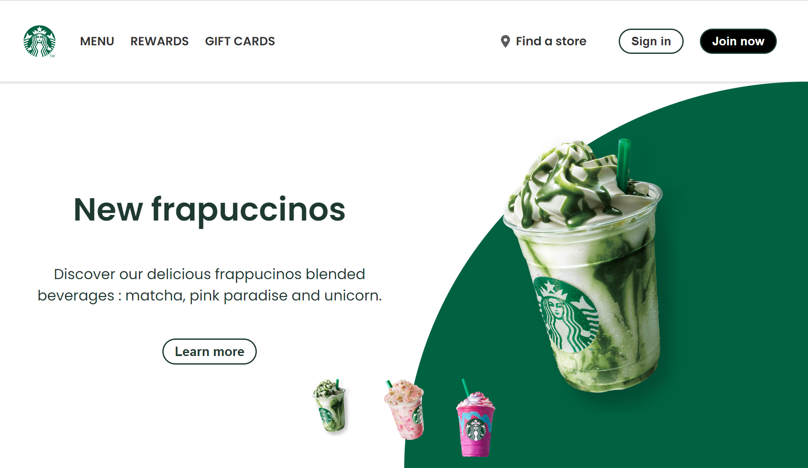
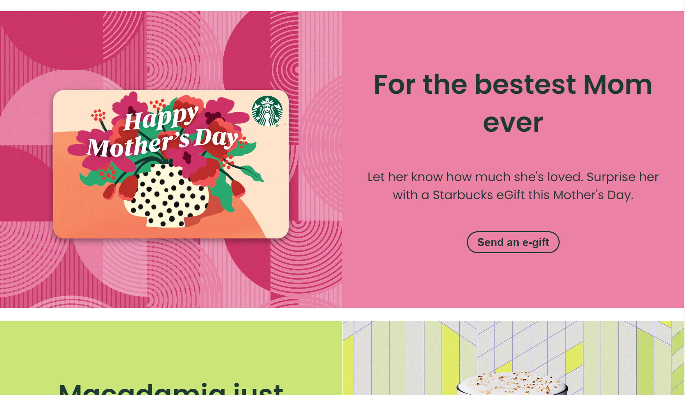

# landing-page-starbucks

Welcome to the Starbucks Coffee Company landing page replica ([check original website](https://www.starbucks.com/)), crafted with HTML, CSS, and JavaScript. This project aims to recreate the engaging and animated landing page of Starbucks.

## Demo

You can view the project live demo [here](https://jesselessa.github.io/landing-page-starbucks/).

## Table of Contents

- [Features](#features)
- [Installation](#installation)
- [Usage](#usage)
- [Screenshots](#screenshots)
- [License](#license)
- [Contact](#contact)

## Features

- **Responsive Design:** The landing page is designed to work seamlessly on various screen sizes.
- **Interactive Navigation:** Explore the Starbucks menu, rewards, and gift cards with an interactive navigation bar.
- **Animated Elements:** Enjoy the visually appealing animations, including the burger menu and selection between different beverages on homepage.
- **Engaging Content:** Learn about new frappuccino offerings with compelling visuals and descriptive text.
- **Multiple Sections:** Discover the latest promotions and products in distinct sections with images and call-to-action buttons.
- **Social Media Integration:** Stay connected through social media links in the footer.

## Installation

1. Clone the repository: `git clone https://github.com/jesselessa/landing-page-starbucks.git`
2. Navigate to the project directory: `cd landing-page-starbucks`
3. Open the `index.html` file in your preferred browser.

## Usage

Explore the interactive elements, navigate through sections, and experience the engaging design of the Starbucks Coffee Company Landing Page replica.

## Screenshots

## Contact

For inquiries, contact me via [LinkedIn](https://www.linkedin.com/in/jessica-elessa/) or [GitHub](https://github.com/jesselessa).

&copy; 2023, Jessica ELESSA - Tous droits réservés
